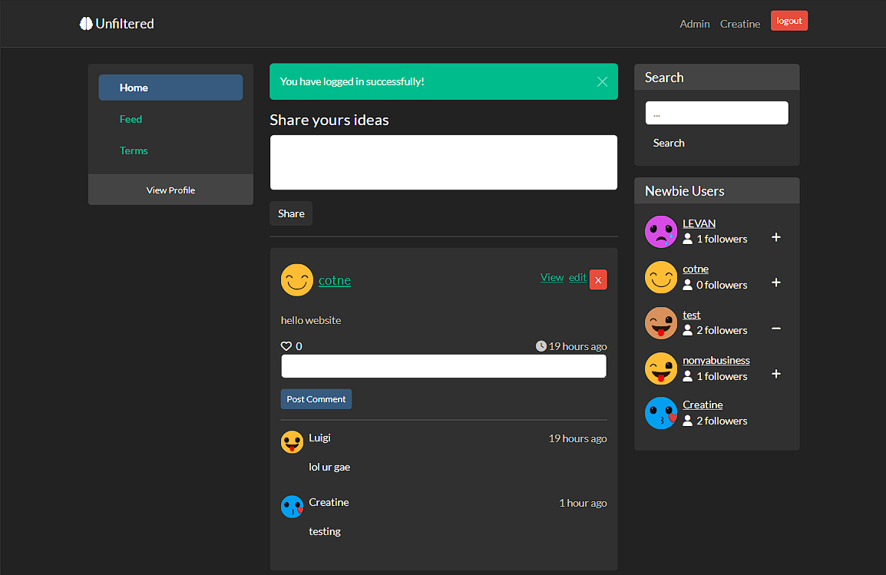

# Unfiltered

Unfiltered is a Twitter clone built using Laravel. It allows users to post ideas, memes, and other content. The application features a range of functionalities including user authorization, CRUD operations, profile pages, an admin panel, and social interactions like following and liking posts. It uses Bootstrap for the frontend styling.

## Features

- **User Authorization**: Registration and login system for users.
- **CRUD Operations**: Create, read, update, and delete posts and profiles.
- **Posting Ideas**: Users can share their ideas and memes.
- **Profile Page**: Each user has a profile page displaying their posts and information.
- **Admin Page**: Admins have a separate panel to manage users and content.
- **Following System**: Users can follow each other.
- **Like System**: Users can like posts.
- **Responsive Design**: Utilizes Bootstrap for a mobile-friendly interface.

## Cons
- Luigi calls you gae.

## Installation

1. **Clone the repository**:
    ```sh
    git clone https://github.com/yourusername/unfiltered.git
    cd unfiltered
    ```

2. **Install dependencies**:
    ```sh
    composer install
    npm install
    ```

3. **Set up environment variables**:
    - Copy `.env.example` to `.env`:
    ```sh
    cp .env.example .env
    ```
    - Update the `.env` file with your database and other configuration details.

4. **Generate application key**:
    ```sh
    php artisan key:generate
    ```

5. **Run migrations**:
    ```sh
    php artisan migrate
    ```

6. **Serve the application**:
    ```sh
    php artisan serve
    ```

## Usage

1. **Register an account** and log in.
2. **Create posts** and share your ideas.
3. **Follow other users** to see their posts.
4. **Like posts** to show appreciation.
5. **Admin users** can manage the platform from the admin page.

## Contributing

Contributions are welcome! Please open an issue or submit a pull request for any improvements or bug fixes.

## License

This project is open-source and available under the [MIT License](LICENSE).

## Acknowledgements

- [Laravel](https://laravel.com/)
- [Bootstrap](https://getbootstrap.com/)
- [Font Awesome](https://fontawesome.com/)

## Credits:

- [Yelo Code](https://www.youtube.com/@yelocode)

---

Happy coding!
